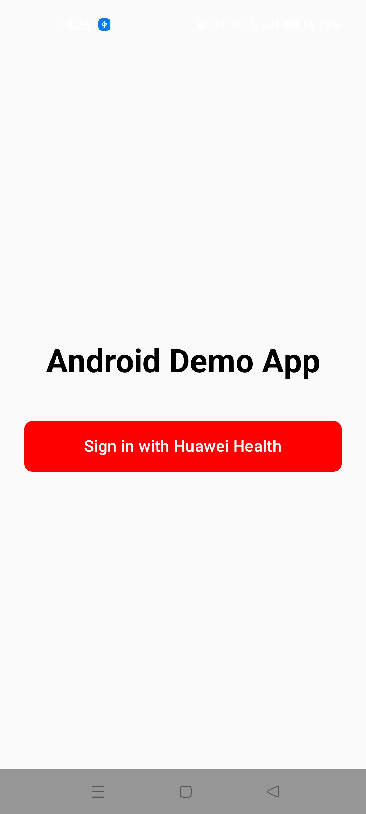
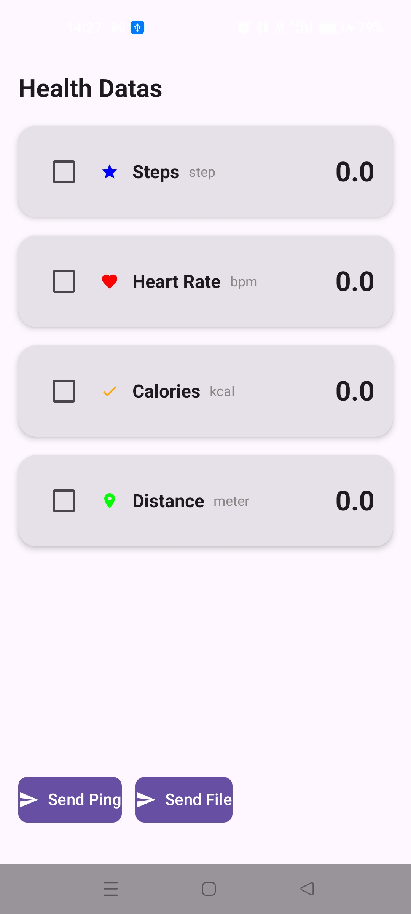

> **Note:** To access all shared projects, get information about environment setup, and view other guides, please visit [Explore-In-HMOS-Wearable Index](https://github.com/Explore-In-HMOS-Wearable/hmos-index).

# Moveo

Moveo is basic wear engine data sending and receiving application. User can send ping and wake up lite device and took health data via wear engine. User logs in Huawei account and device gets data and sends it phone.

The application acts as the mobile counterpart of the moveo wearable app and is responsible for data display.

> **Companion app:** This is the Android phone side of Moveo. The Lite Wearable watch app it pairs with is [sportwatch-moveo](https://github.com/Explore-In-HMOS-Wearable/sportwatch-moveo). Install both to try the full flow.

# Preview

<div>
  
  
</div>


# Use Cases

- Pairing with Huawei Watch 5
- Real-time device connection state monitoring
- P2P message and data transfer between phone and watch


# Technology

## Stack

- **Language:** Kotlin 1.9+
- **UI:** Jetpack Compose
- **Architecture:** MVVM + Clean Architecture
- **Async:** Kotlin Coroutines & Flow
- **Wearable Communication:** Huawei Wear Engine SDK

## Required Permissions

- Bluetooth
- Nearby Devices
- Internet
- Foreground Service
- Notification Access

# Directory Structure

```
├── app/src/main/java/com.hsmosdemos.moveo
│   ├── common/
│       ├── Constants.kt
│       └── TokenManager.kt
│   ├── model/
│       ├── DeviceState.kt
│       ├── FileState.kt
│       ├── HealthDataResult.kt
│       ├── HealthResponse.kt
│       ├── HomeItem.kt
│       ├── MessageState.kt
│       ├── TokenResponse.kt
│       └── UiState.kt
│   ├── pages/
│       ├── AuthenticationScreen.kt
│       ├── HomeScreen.kt
│       ├── LoginScreen.kt
│       └── MainScreen.kt
│   ├── service/
│       ├── AuthApi.kt
│       ├── HealthApi.kt
│       └── RetrofitClient.kt
│   ├── viewmodel/
│       ├── AuthenticationViewModel.kt
│       └── HomeViewModel.kt
│   └── wearengine/
│       ├── AuthManager.kt
│       ├── DeviceManager.kt
│       └── P2pManager.kt
│   └── MainActivity.kt
```

# Constraints and Restrictions

## Supported Devices

- Android Studio Emulator
- Huawei Watch 5
- DevEco Studio Simulator


# License (MIT)

Moveo is distributed under the terms of the MIT License. See the [license](LICENSE) for more information.